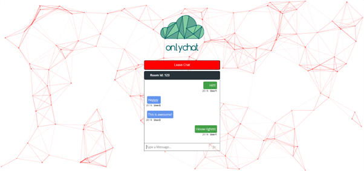
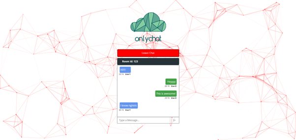

<a>
    <picture>
    <source media="(prefers-color-scheme: dark)" alt="OnlyChat" srcset="./Banner.png" />
    
    </picture>
</a>

<h4 align="center">
    <a href="https://onlychatv1.netlify.app/">Website</a> |
    <a href="#features">Features</a> |
    <a href="#prerequisites">Prerequisites</a> |
    <a href="#installation--setup">Setup</a> |
    <a href="#usage">Usage</a>
</h4>

<div align="center">
  <h2>
    A room-based chat application built on <br />
    <a href="https://socket.io/">Socket IO</a> <br />
    <br />
  </h2>
</div>

<br />


[!(OnlyChat Preview)](https://github.com/user-attachments/assets/419ff8f7-4aec-49e6-8c0c-a1867c02eaeb)


<p align="center">
  Chat from anywhere, anytime you want.
</p>

## Features

- 💬 **Room-Based Chats**: Users can create or join different rooms for topic-specific conversations.
- ⚡ **Real-Time Messaging**: Messages sent in a room are instantly received by all users in that room.
- 👤 **User Nicknames**: Users can set a nickname when joining a chat room.
- 📱 **Responsive Design**: The app works well on both desktop and mobile devices.

## Prerequisites

- **Node.js**: To handle the backend and WebSocket connections.
- **Socket.io**: For real-time, bidirectional communication between clients and the server.
- **Text Editor**: Like VS Code, or Sublime Text

## Technologies Used

- [React.js](https://react.dev/): Frontend JavaScript library used to build the user interface and manage application state.
- [Express.js](https://expressjs.com/): A web framework for Node.js, used to build the backend and handle routes.
- [Node.js](https://nodejs.org/en): Backend runtime for handling server-side operations and WebSocket connections.
- [Socket.io](https://socket.io/): Library for enabling real-time, bidirectional communication between the server and clients.

## Installation & Setup

### Step 1: Clone the repository

```bash
git clone https://github.com/ArshvirSk/OnlyChat.git
```

### Step 2: Install dependencies

Navigate to the project directory and install the necessary Node.js packages.

```bash
cd client
npm install
```

and

```bash
cd server
npm install
```

### Step 3: Make changes in the files

Go to **client/src/index.js** and uncomment these lines:

```javascript
// const socket = io.connect("https://chat-app-server-fwg2.onrender.com/");
const socket = io.connect("http://localhost:3001");
```

### Step 4: Run the application

Run the server application using the following command:

```bash
cd server
npm start
```

Run the client application using the following command:

```bash
cd client
npm start
```

## Usage

1. Joining a Room:

   - When you access the application, you'll be prompted to enter a room name and your nickname. You can either create a new room by entering a unique room name or join an existing room by entering its name.

2. Sending Messages:

   - Once inside the chat room, type your message in the input field and hit "Send." Your message will appear in the chat window, and all users in the room will receive it in real time 📩.

3. Active Users:

   - A list of active users in the chat room will be displayed on the side. You’ll be notified when a user joins or leaves the room 👥.

4. Switching Rooms:

   - To switch rooms, simply refresh the page or open a new tab and enter a different room name.

<div align="center">
  <figure>
    <a href="https://onlychatv1.netlify.app/" target="_blank" rel="noopener">
      
    </a>
  </figure>
  <figure>
    <a href="https://onlychatv1.netlify.app/" target="_blank" rel="noopener">
      
    </a>
  </figure>
</div>

## Acknowledgments

- [Socket.io](https://socket.io/) for enabling real-time communication.
- [Node.js](https://nodejs.org/en) for making server-side JavaScript development possible.
